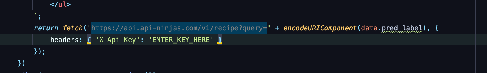
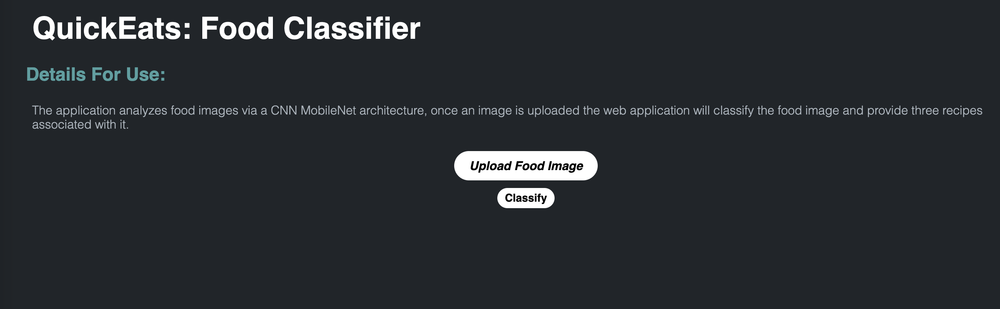
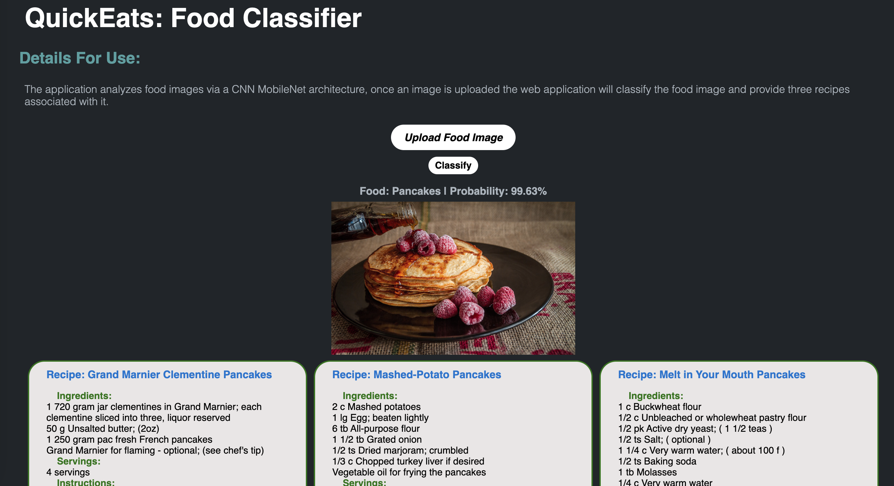

# **QuickEats: A Foodie Solution**

This project is a part of the ADS-599 course in the Applied Data Science Program at the University of San Diego.

### **Contributors**
* Ivan Chavez
* Lane Whitmore
* Uyen Pham

## Project Status: Active

## Installation
To use and run this project on your machine, follow these steps: 

### 1. Downloading the image data to run the notebooks
As the dataset too large to upload to GitHub, we suggest following FastAI's download protocol.
Assuming FastAI has been installed in your Python environment of choice, you can follow these steps:
- Import the neccessary packages:
   from fastai.vision.all import URLs, get_image_files, untar_data
- Download the Food-101 dataset:
   path = untar_data(URLs.FOOD)
- Print the path:
   path.ls()
   Count the images in path (should be 101,000):
   files = get_image_files(path/"images")
   print("Number of Food Images:", len(files))

### 2. Requesting API key to call for recipes in QuickEats app
(need instruction)

### 3. Set up and run QuickEats app 

See ***static*** for the styles and formatting of a web page and ***template*** for html set up. PLease enter the API key acquired ealier in the ***templates.html*** into the part showed in the code snippet below:

The following steps are neccesary to run the app:

- Clone the repository to your local machine.

- Open a command line interface and navigate to the directory of the cloned repository.

- Run the following command to start the local server: `uvicorn main:app --reload`
   
- Once the server is running, open your web browser and enter the following URL: http://127.0.0.1:8000
   
- You will be directed to the API application interface as below
   
   
     Click **Upload Food Image** button to upload a random food image dowloaded from the internet
         
     Click the **Classify** button to initiate the analysis
   
     The API will process the image and provide the the name of the food, the probability of the predicted class and three corresponding recipes. Below is an axample of the output
   
   

## Project Intro/Objective
The main purpose of this project is to leverage machine learning techniques to develop a reliable and convenient solution for food enthusiasts. We aim to build an image recognition system for food integrated with a recipe API, simplifying the process of identifying food and providing accurate recipe recommendations. Our goal is to enhance the culinary experience for users, inspiring them to explore new dishes and flavors easily.

## Methods Used
- Machine Learning
- Data Engineering
- Data Visualization
- Image Processing

## Technologies
- Python
- FastAPI
- HTML
- CSS

## Project Description
Our project focuses on developing an image recognition system for food using convolutional neural networks (CNNs) on the Food101 dataset. The Food101 dataset consists of a diverse collection of food images representing different food items.

To achieve our goal, we will preprocess the images and utilize transfer learning to train the CNN model. The trained model will then be integrated into a user-friendly web application, allowing users to easily upload food images through the user interface.

Once the user uploads an image, the application will use the trained model to accurately classify the food type in the image. Additionally, the application will fetch relevant recipe recommendations from a recipe API based on the identified food type, providing users with a delightful culinary experience.

Throughout the project, we anticipate challenges related to data quality, model performance, and the seamless integration of the recipe API. We will address these challenges by iteratively improving the model, optimizing hyperparameters, and fine-tuning the integration process.

## License
This project is licensed under the [MIT License](LICENSE).

## Acknowledgments
We would like to express our gratitude to our course instructor for providing valuable guidance and support throughout the project. 
